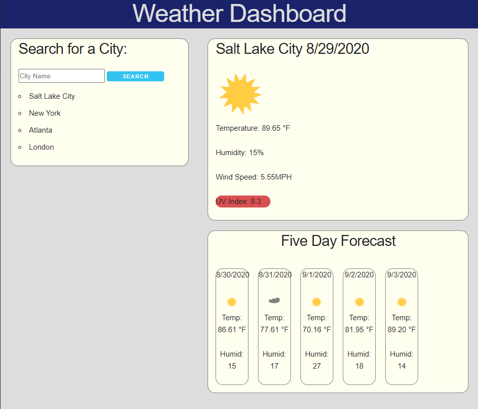

# Weather Dashboard 

Weather Dashboard is a sight dedicated to pulling weather information from a specific city for the current day as well as a forecast for the next five days.

Used skeleton css which can be found [here](http://getskeleton.com/) and I pulled the cdn for skeleton css [here](https://cdnjs.com/libraries/skeleton)

The favicon was pulled from google images.

I used images for the weather icons found on [OpenGameArt.org](https://opengameart.org/) and used the icons made by Alex M. which can be found [here](https://opengameart.org/content/weather-icons)

I used [this](https://coderrocketfuel.com/article/convert-a-unix-timestamp-to-a-date-in-vanilla-javascript) site to help convert unix time to a regular timestamp.

I found the measurements of the UV index [here](https://www.theweathernetwork.com/us/forecasts/uv/utah/salt-lake-city) giving Salt Lake City as an example as well as a scale.

This site is deployed [here](https://mrcartree.github.io/weather-dashboard/)

Authored by [Zach LaFleur](https://github.com/MrCartree)